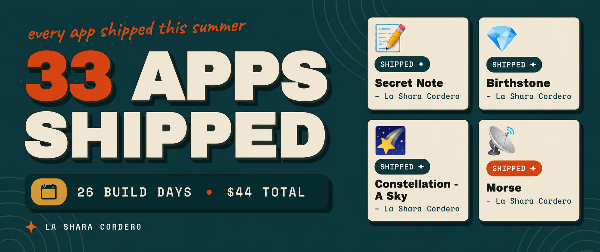

# Hot AR Summer 2026

33 small deterministic web apps, built and shipped daily through July 2026 for [Netlify's Hot AR Summer](https://hot-ar-summer.netlify.app/).

**Builder:** L. Cordero (Shara) · [@earlgreyhot1701d](https://dev.to/earlgreyhot1701d)
**Showcase wall:** [my builder page](https://hot-ar-summer.netlify.app/showcase/builder/la-shara-cordero)
**Portfolio:** [Clew Labs](https://earlgreyhot1701d.github.io/Clew-Labs/)
**Write-up:** [`article/hot-ar-summer-recap.md`](article/hot-ar-summer-recap.md)

---

## The rule

**No `Math.random` in any selection logic.**

Every app derives its output from its input. Same input, same output, every time, with the derivation visible. The apps hash their inputs, run a fixed rule table, and show their work.

This started as a design principle and turned out to be a pricing model. A deterministic app calls a model zero times after it is built, so serving it is effectively free forever.

## The receipts

| Line item | Credits | Share |
|---|---:|---:|
| AI inference (Agent Runners) | 2,899.6 | 72.7% |
| Production deploys (41) | 615 | 15.4% |
| Agent Runners compute (47.41 GB-hrs) | 474.1 | 11.9% |
| Web requests (3,160) | 0.6 | 0.02% |
| Bandwidth (0.03 GB) | 0.7 | 0.02% |
| **Total** | **3,990** | |

- ~121 credits per app, roughly $1.33 an app
- 41 deploys for 33 apps (1.24 per app)
- 3,160 visits served for 0.6 credits
- 1.7% of all tokens were output. The other 98.3% was the model reading context.

## Guardrail audit

Run across all 33 source files in this repo, with comments stripped so the `NEVER:` headers do not count as hits.

| Guardrail | Result |
|---|---|
| `Math.random` in code | **0 of 33** |
| `eval` | **0 of 33** |
| `fetch` / `XMLHttpRequest` | **0 of 33** |
| `localStorage` / `sessionStorage` | **0 of 33** |
| `.innerHTML` | **0 of 33** (after a fix, see below) |

The `Math.random` rule held across every single app. Nothing stored, nothing sent, no network calls at runtime.

The `.innerHTML` line did not start at zero. The first audit of this repo found two apps using it: `the-honest-coin` once in `resetState()`, and `crypt-type` four times building headline spans and description lines. In both cases the data was hardcoded and no user input reached it, so there was no injection risk, but it broke the `textContent` rule the rest of the suite follows. Both are now rewritten with `createElement` and `textContent`, verified to produce byte-equivalent markup and no console errors.

## Build stack

| Stage | Tool |
|---|---|
| Brainstorm, architecture, rule tables, voice | Claude |
| Single-file HTML generation | ChatGPT |
| Deploy | Netlify Agent Runners (default: Gemini) |

## The apps

All 33. Live links where I still have them.

| App | Source | Live |
|---|---|---|
| Auspice | [`apps/auspice`](apps/auspice) | [live](https://auspice.netlify.app/) |
| Birthstone | [`apps/birthstone`](apps/birthstone) | |
| Blazon | [`apps/blazon`](apps/blazon) | |
| Certified | [`apps/certified`](apps/certified) | |
| Constellation | [`apps/constellation`](apps/constellation) | |
| Crypt Type | [`apps/crypt-type`](apps/crypt-type) | [live](https://crypt-type.netlify.app/) |
| Dewey | [`apps/dewey`](apps/dewey) | |
| Even Odds | [`apps/even-odds`](apps/even-odds) | |
| Free Throw | [`apps/free-throw`](apps/free-throw) | |
| How Long Ago Was That | [`apps/how-long-ago-was-that`](apps/how-long-ago-was-that) | [live](https://how-long-ago.netlify.app/) |
| Is it Friday? | [`apps/is-it-friday`](apps/is-it-friday) | [live](https://is-it-friday-hmmm.netlify.app/) |
| Luka Fit Index | [`apps/luka-fit-index`](apps/luka-fit-index) | [live](https://luka-fit-index.netlify.app/) |
| Messi vs. Yamal | [`apps/messi-vs-yamal`](apps/messi-vs-yamal) | [live](https://messi-or-yamal.netlify.app/) |
| Mood Ring | [`apps/mood-ring`](apps/mood-ring) | [live](https://mood-ring-index.netlify.app/) |
| Morse | [`apps/morse`](apps/morse) | |
| No Notes | [`apps/no-notes`](apps/no-notes) | |
| Proteus (codename generator) | [`apps/proteus`](apps/proteus) | |
| Roman | [`apps/roman`](apps/roman) | |
| Saint of Small Things | [`apps/saint-of-small-things`](apps/saint-of-small-things) | [live](https://saint-of-small-things.netlify.app/) |
| Same Boat | [`apps/same-boat`](apps/same-boat) | |
| Same Sky | [`apps/same-sky`](apps/same-sky) | [live](https://same-sky.netlify.app/) |
| Scrivener | [`apps/scrivener`](apps/scrivener) | [live](https://scrivenerclew.netlify.app/) |
| Secret Note | [`apps/secret-note`](apps/secret-note) | |
| Sortes | [`apps/sortes`](apps/sortes) | [live](https://sortes-guidance.netlify.app/) |
| Spell It | [`apps/spell-it`](apps/spell-it) | |
| The Decision 2026 | [`apps/the-decision-2026`](apps/the-decision-2026) | [live](https://the-decision.netlify.app/) |
| The Honest Coin | [`apps/the-honest-coin`](apps/the-honest-coin) | |
| Tidings | [`apps/tidings`](apps/tidings) | |
| Too Late to Text? | [`apps/too-late-to-text`](apps/too-late-to-text) | |
| Tuning Fork | [`apps/tuning-fork`](apps/tuning-fork) | |
| Vivant Linguae Mortuae | [`apps/vivant-linguae-mortuae`](apps/vivant-linguae-mortuae) | [live](https://vivant-linguae-mortuae.netlify.app/) |
| What's for Dinner? | [`apps/whats-for-dinner`](apps/whats-for-dinner) | [live](https://whats-for-dinner-tonight.netlify.app/) |
| With Appreciation | [`apps/with-appreciation`](apps/with-appreciation) | [live](https://with-appreaciation.netlify.app/) |

### Built, never submitted

Two more came out of the same practice after the window closed. They are in [`unsubmitted/`](unsubmitted).

| App | What it does |
|---|---|
| Objection | Rules on a statement against twelve grounds of evidence, each cited to a real Federal Rule. |
| Palindrome | Folds a phrase on its mirror line and shows exactly where the symmetry breaks. |

And the one that shipped but never got counted: [the attestation page](https://hot-ar-summer-attestation.netlify.app/), serial `5307-062B`, built and deployed July 31 from a phone at a restaurant table, finished after the submission window closed.

## Repo layout

```
.
├── README.md
├── assets/
│   ├── banner.png              # repo banner
│   └── cover-1000x420.png      # dev.to cover
├── article/
│   └── hot-ar-summer-recap.md  # the dev.to write-up
├── apps/
│   └── <app-name>/
│       └── index.html          # one self-contained file per app
└── unsubmitted/
    └── *.html                  # built after the window closed
```

## Running any of them

There is no build step and no dependencies. Open the file.

```bash
open apps/whats-for-dinner/index.html
```

Or serve the whole thing locally:

```bash
python3 -m http.server 8000
```

## License

MIT. Take anything useful.

---

*AI Assisted. Human Approved. Powered by NLP.*
